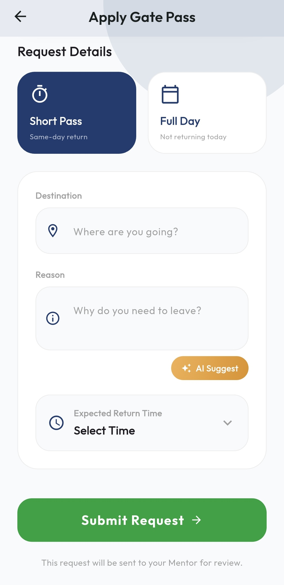
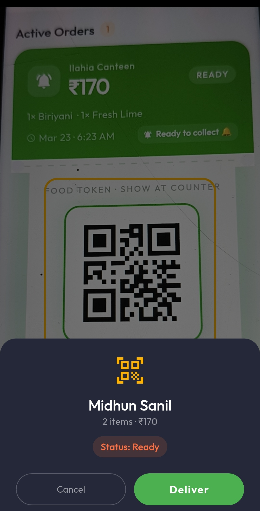
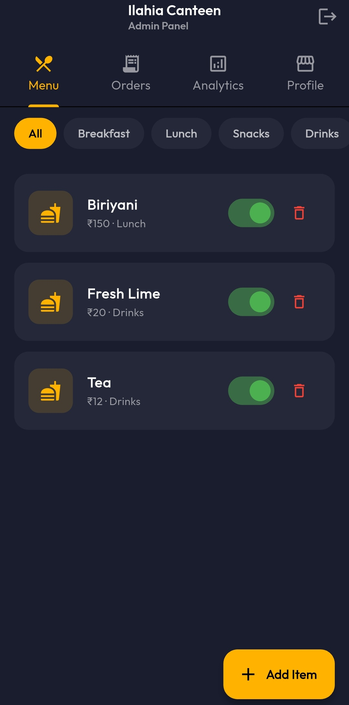
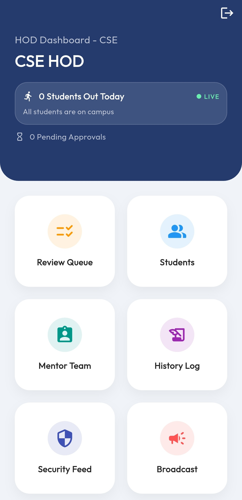
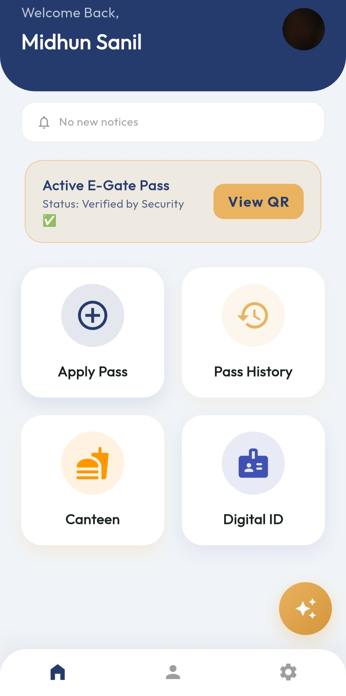
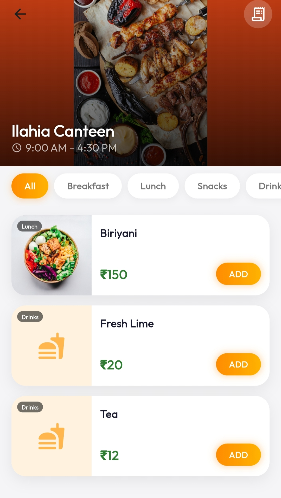

# CampusOne - Smart Gatepass & Campus Management App 🎓


CampusOne is a comprehensive Android application designed to digitize and streamline campus operations. It replaces manual paperwork with a modern, fast, and secure digital ecosystem, featuring role-based dashboards, a real-time QR code gate pass system, AI assistance, and a full-fledged canteen ordering system!

🌐 **[Test the App Live (No Installation Required!)](https://appetize.io/app/b_zqvq37zti7qmipgjwwwkgosona)**

## ✨ Key Features

- **🛡️ Smart Gatepass System**: 
  - Students can apply for Short (Same-day) or Full-Day passes.
  - Multi-level approval system (Mentor ➡️ HOD).
  - Security guards can scan auto-generated QR codes to verify and log entry/exit in real-time.
- **🤖 Integrated AI Assistant**: Powered by NVIDIA Nemotron, the in-app AI can automatically apply for gate passes, check pass statuses, and navigate the app for the user via natural language.
- **🍔 Digital Canteen**: Browse the menu, place orders, and pay online via Razorpay or Cash on Delivery. Live order status tracking included!
- **👥 Role-Based Dashboards**: Tailored interfaces for Students, Mentors, HODs, Security, and Admin staff.
- **📢 Notice Board & Digital ID**: Instant announcements from HODs and a digital ID card for every student.

## 🛠️ Tech Stack

- **Frontend**: Flutter (Dart)
- **Backend**: Firebase (Cloud Firestore, Authentication, Storage)
- **AI Integration**: OpenRouter API (NVIDIA Nemotron 30B)
- **Payments**: Razorpay Gateway

## 🚀 Getting Started

If you want to run this project locally:

1. Clone the repository:
   ```bash
   git clone https://github.com/midhun-404/CampusOne-App.git
   ```
2. Navigate to the project directory:
   ```bash
   cd CampusOne-App
   ```
3. Install dependencies:
   ```bash
   flutter pub get
   ```
4. **Important Configuration**: 
   - Add your own OpenRouter API key in `lib/services/ai_service.dart`.
   - Add your Razorpay Test key in `lib/core/constants/app_constants.dart`.
   - Ensure you have configured a Firebase project and added your `google-services.json` file.
5. Run the app:
   ```bash
   flutter run
   ```

## 📸 Screenshots
<div align="center">
  
  
  
  
  
  
</div>

---
*Built with ❤️ for a smarter, digital campus experience.*
