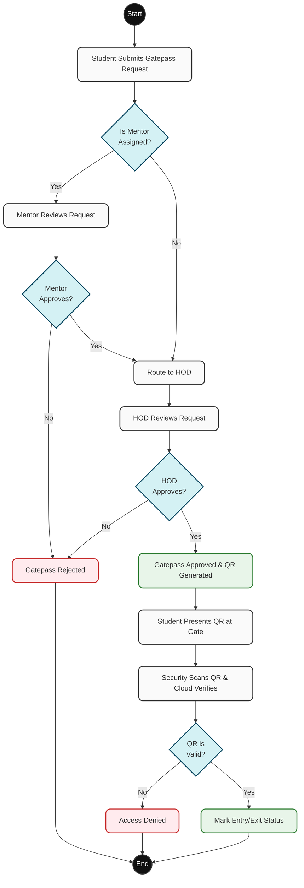
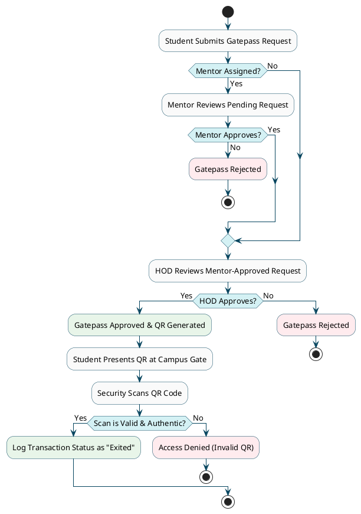

# CampusOne Smart Management System - Activity Diagram

This document contains the core Activity Diagram for the **Gatepass Application flow**. It emphasizes the flowchart sequence involving decisions (diamonds), parallel processes, actions, and terminations across the Gatepass lifecycle.

## 1. Mermaid Version (Preview)

Viewable in GitHub, Notion, or VS Code markdown previews. It shows the logical flow of actions.

## 2. PlantUML Version (Strict UML Standardization)

If you are using this in formal architecture documentation, copy and run this code in [PlantText](https://www.planttext.com/) or the PlantUML CLI. It generates a perfectly strictly-compliant UML Activity Diagram (using black circles for start/stop, rounded boxes for actions, and diamonds for conditions).

