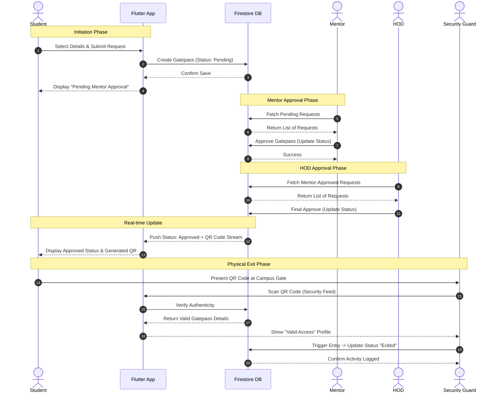
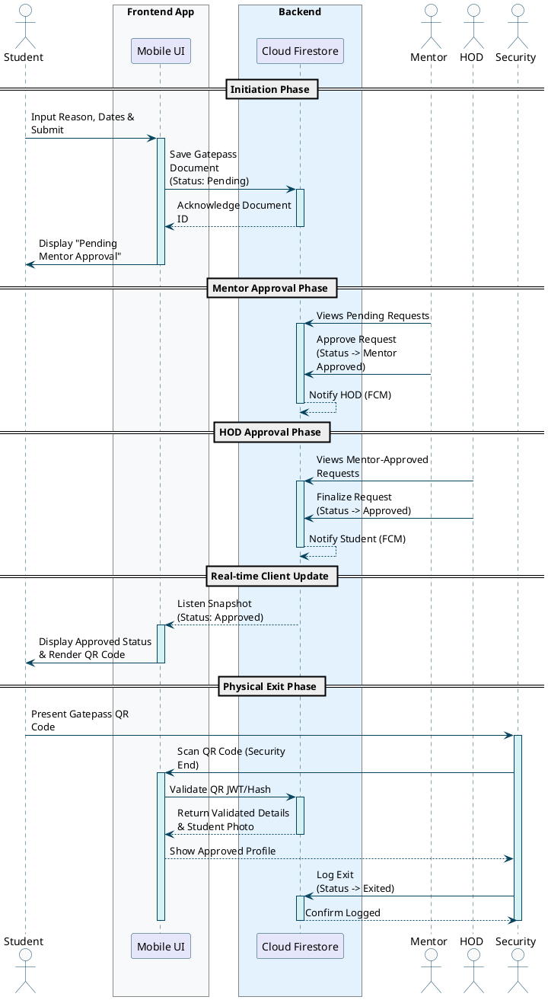

# CampusOne Smart Management System - Sequence Diagram

This document contains the core workflow sequence diagram for the **Gatepass Request, Approval, & Verification Process**. It follows the standard lifecycle of a gatepass flowing through the Student, App, Cloud Database, Mentor, HOD, and finally the Security Guard.

## 1. Mermaid Version (Preview)

This version tracks the timeline from top to bottom. It will render automatically in Markdown viewers that support Mermaid.js.

## 2. PlantUML Version (Strict UML Layout)

If you are using this in a formal architecture documentation book, run the following code in any PlantUML editor to generate the strictly compliant architectural structure.

