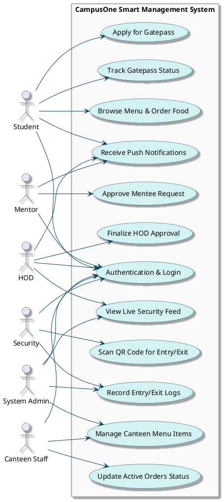

# CampusOne Smart Management System - Use Case Diagram

This document contains the perfect Use Case Diagram for the CampusOne Smart Gatepass & Canteen Management App. It covers all defined actors (Student, Mentor, HOD, Security, Canteen Staff, Admin) and their specific use cases across the Gatepass, Authentication, Security, and Canteen modules.

## 1. Mermaid Version (Preview)

You can preview this diagram natively in GitHub, Notion, Obsidian, and VS Code (with the Mermaid preview extension). The layout is arranged top-to-bottom to closely map to a portrait (3:4) aspect ratio.

```mermaid
flowchart TD
    %% Styling Config
    classDef actor fill:#E6E6FA,stroke:#333,stroke-width:2px,color:#000
    classDef usecase fill:#D4F1F4,stroke:#05445E,stroke-width:2px,shape:capsule,color:#000
    classDef sysBoundary fill:#FAFAFA,stroke:#A9A9A9,stroke-width:2px,stroke-dasharray: 5 5

    %% -----------------
    %% L E F T   A C T O R S
    %% -----------------
    Student((("👩‍🎓\nStudent\n "))):::actor
    Mentor((("👨‍🏫\nMentor\n "))):::actor
    HOD((("👨‍💼\nHOD\n "))):::actor

    %% -----------------
    %% R I G H T   A C T O R S
    %% -----------------
    Security((("👮\nSecurity\n "))):::actor
    Canteen((("👨‍🍳\nCanteen Staff\n "))):::actor
    Admin((("👨‍💻\nSystem Admin\n "))):::actor

    %% -----------------
    %% S Y S T E M   B O U N D A R Y
    %% -----------------
    subgraph CampusOne ["CampusOne Smart System Boundary"]
        direction TB
        
        %% Authentication & General
        UC_Auth([1. Authentication & Login]):::usecase
        UC_Notif([2. Receive Push Notifications]):::usecase
        
        %% Gatepass Module
        UC_ReqGP([3. Apply for Gatepass & View Status]):::usecase
        UC_MentorApprove([4. Approve Mentee Request]):::usecase
        UC_HODApprove([5. Assign Final HOD Approval]):::usecase
        
        %% Security Module
        UC_ScanQR([6. Scan QR Code & Verify Gatepass]):::usecase
        UC_LogInOut([7. Handle In/Out Logs]):::usecase
        UC_SecFeed([8. Monitor Live Security Feed]):::usecase
        
        %% Canteen Module
        UC_MenuOrder([9. Browse Canteen Menu & Order Food]):::usecase
        UC_ManageOrder([10. Update & Monitor Active Orders]):::usecase
        UC_ManageMenu([11. Manage Canteen Menu Items]):::usecase
    end

    %% Apply System Style
    class CampusOne sysBoundary

    %% -----------------
    %% R E L A T I O N S H I P S
    %% -----------------
    
    %% Student Connections
    Student --> UC_Auth
    Student --> UC_ReqGP
    Student --> UC_MenuOrder
    Student --> UC_Notif

    %% Mentor Connections
    Mentor --> UC_Auth
    Mentor --> UC_MentorApprove
    Mentor --> UC_Notif

    %% HOD Connections
    HOD --> UC_Auth
    HOD --> UC_HODApprove
    HOD --> UC_SecFeed
    HOD --> UC_Notif

    %% Security Connections
    Security --> UC_Auth
    Security --> UC_ScanQR
    Security --> UC_LogInOut
    
    %% Canteen Connections
    Canteen --> UC_Auth
    Canteen --> UC_ManageOrder
    Canteen --> UC_ManageMenu
    
    %% Admin Connections
    Admin --> UC_Auth
    Admin --> UC_SecFeed
    Admin --> UC_LogInOut
    Admin --> UC_ManageMenu
```

## 2. PlantUML Version (Strict 3:4 Aspect Ratio)

If you are printing this for a project record book or formal documentation, use the code below in any online PlantUML server (like [PlantText](https://www.planttext.com/) or [PlantUML Web](http://www.plantuml.com/plantuml/uml/)). 

The command `skinparam ratio 3/4` mathematically forces the output diagram into a perfect **3:4 portrait aspect ratio**, making it ideal for standard A4 paper presentation. It also maps directly to strict UML logic (Stick figures + proper Ovals).

